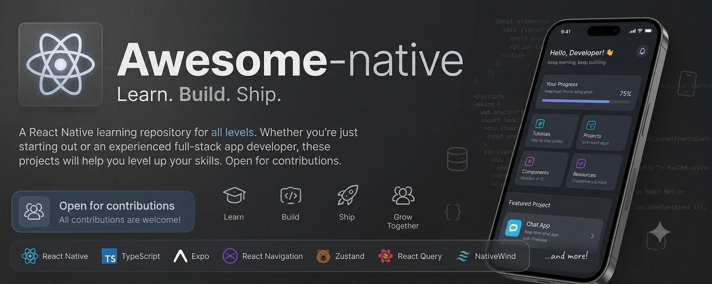

<p align="center">
  
</p>

<h1 align="center">Awesome Native</h1>

<p align="center"><b>
An Awesome React native repository with All levels Learning projects
</b></p>
<p align="center">
A repository with no limits, Add you're projects, or fork this repo and use any of this Awesome projects  
</p>

<div align="center">
  
  
  
  
  
</div>

## 📌 About

Awsome native is an open source repo that contains a collection of useful projects 
In this repo, You'll find Projects that suit you're level whether you're trying to practise react native, or want to make a full stack app that's ready for shiping.
You'll find real world examples, unique apps that bring new react native concepts, clean patterns, All in one Awsome Repo

## 🧩 What you'll find

- Beginner-friendly apps
- UI components and layouts
- projects with API integrations
- Unique mini apps
- Real world Production ready

## 📸 Preview


## 🤝 Contributing

We apreciate you're contributions ❤️
> *"When we have welcoming communities of contributors, open source software gets better and more useful to everyone."*
> — **Limor Fried**


### How to contribute:
💡 Please create a separate branch for each contribution. Do not push directly to main.
### 1. Fork the repository
Click the **Fork** button (top right this repo) [awesome-native](https://github.com/zakilisee/awesome-native).

### 2. Clone your fork
```bash
git clone https://github.com/YOUR_USERNAME/awesome-native.git
cd awesome-native
```

### 3. Create a branch
```bash
git checkout -b feature/add-my-project
```

### 4. Make changes than commit
```bash
git add .
git commit -m "Add new React Native project"
```

### 5. Push to GitHub
```bash
git push origin feature/add-my-project
```

### 6. Open a Pull Request
Go to your fork on GitHub than click **Compare & pull request**.

No need to be perfect, Small changes make a big diffrence

## 🌱 Good First Contributions

- Improve the UI of exicting projects
- Fix bugs or typos
- Improve exicting project's code
- Add comments (//) for readability
- Add new Projects 
- Improve This documantation (README.md)

## ⭐ Support
If you find this project helpful, please give it a star ⭐
It helps others discover it too.

Show you're support so we can make something Awsome, Together!
